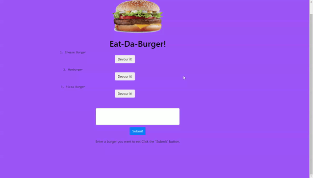

# Eat the burger     

This application allows the user to input new burgers and select wich burgers to "devour" which will move the burger to the right hand side. This application uses express mysql and handlebars
    
### Demo
Click [HERE](https://tranquil-savannah-21710.herokuapp.com/burgers) to view deployed application.

    

# Usage
 - just click the devour button! or enter a new burger

# Questions
If you have any questions or would like to contact me feel free to reach me at:
- Email: santiago.sjs@gmail.com
- Github: [santu14](https://github.com/santu14)

## License

                Copyright 2020  Santiago Solana

    Permission to use, copy, modify, and/or distribute this software for any purpose with or without fee is hereby granted, provided that the above copyright notice and this permission notice appear in all copies.
